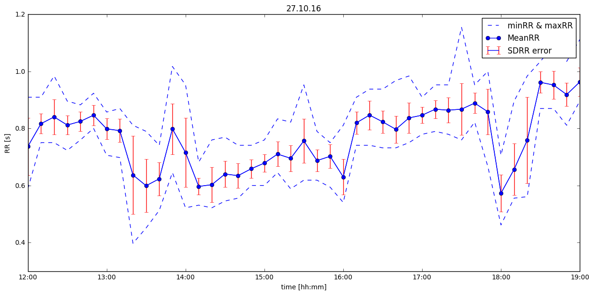

# Physiological Stress Analysis with Heart Rate Data

Seminar: Physiological Data Analysis for Educational Technologies

## SDRR Data Analysis
from Christian Lemke

## Python version
* Python3 is needed for this exercise

## Install jupyter notebook
The most common way to install jupyter notebook is using pip3:
`pip3 install jupyter`

Note: Please see the reference to install jupyter notebook on your operation system http://jupyter.org/install.html

## Quick Start (For Linux and Macosx)

* clone this repository with `git clone https://github.com/yingding/pda16ws17.git`
* or download the content of this repository as zip file
* change your current directory to the repository path `path/pad16ws17`
* start jupyter notebook from the directory path with `jupyter notebook &`
